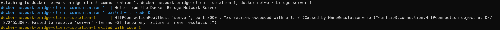

# Understand Docker Bridge

## Overview

This tutorial is designed to help you understand and work with Docker's bridge network, which is the default network type for Docker containers. The bridge network allows containers to communicate with each other while remaining isolated from the host network.

## Prerequisites

- Docker installed on your machine.
- Basic knowledge of Python and Docker commands.

## Objectives

- Learn about Docker's bridge networking.
- Set up a simple client-server communication using Docker containers on a bridge network.
- Observe and understand the isolation and communication capabilities of the bridge network.

## Project Structure

- _server.py_: A simple Python HTTP server.
- _client.py_: A Python script acting as a client to send requests to the server.
- _Dockerfile-server_: Dockerfile to build the server container.
- _Dockerfile-client_: Dockerfile to build the client container.
- _docker-compose.yaml_: A Docker Compose file to run the containers together.

## Steps with Docker command

### Step 0: Create two custom bridge networks

The first will be used to prove that client and the server can communicate from inside the network.

```
docker network create first-bridge-network
```

The second will be used to demonstrate the isolation between the different bridge networks.

```
docker network create second-bridge-network
```

### Step 1: Build the Docker images

1. Building the image for the server:

```
docker build --rm -t bridge-network-server -f Dockerfile-server .
```

2. Bulding the image for the client:

```
docker build --rm -t bridge-network-client -f Dockerfile-client .
```

**Explenation:**

- -t: tag/name for the build that will be called in the following command
- --rm: Remove intermediate containers after a successful build

### Step 2: Run the server inside the first-network

Running the server container:

```
docker run -d --rm --network=first-bridge-network --name server bridge-network-server
```

This container will run until your stop it, and will be used for the next steps.

**Explenation:**

- -d: Run container in background and print container ID
- --rm: Remove the container after execution
- --network: Connect a container to a network
- --name: Name for the container

### Step 4: Run a client container inside the first-network

Run the container for the client :

```
docker run --rm --network=first-bridge-network bridge-network-client
```

The output of this service is: `Hello from the Docker Bridge Network Server!`. It means that the client send a request to the server on the same network, and the server respond to the request loaded with the message.
So it shows the **communication** inside the bridge network.

### Step 4: Run a client container inside the second-network

Run the container for the client :

```
docker run --rm --network=second-bridge-network bridge-network-client
```

The service will run for a little longer than the previous before exiting with the following error: `HTTPConnectionPool(host='server', port=8000): Max retries exceeded with url: / (Caused by NameResolutionError("<urllib3.connection.HTTPConnection object at 0x7ff07c256d00>: Failed to resolve 'server' ([Errno -3] Temporary failure in name resolution)"))`.

This means that the server service has not been found inside the network. So it shows the **isolation** of the bridge network.

## Steps with Docker Compose:

Run the following command to build and start the containers for the same previous results:

```
docker compose up --build --remove-orphans
```

After the following lines showing the communication and the isolation, you can quit the process with a `Ctrl+C`:



**Explenation:**

- --build: Build images before starting containers.
- --remove-orphans: Remove containers for services not defined in the Compose file.

## How it works

1. **Default Network Mode:** When a Docker container is run without specifying a network, it is connected to a default bridge network. This network acts as a private internal network for containers on the host machine.

2. **Isolation and Communication:** Containers on the same bridge network can communicate with each other using their internal IP addresses or names. However, they are isolated from containers on different bridge networks and from the host network, unless explicitly configured to connect.

3. **Network Namespace:** Docker utilizes network namespaces to provide isolation. Each container has its own network stack, ensuring that the processes in one container cannot see the network traffic of another, unless they are on the same network.

4. **Inter-Container Connectivity:** Containers on the same bridge network can discover and communicate with each other directly. This is facilitated by Docker's internal DNS resolver which allows containers to resolve each other by name.
